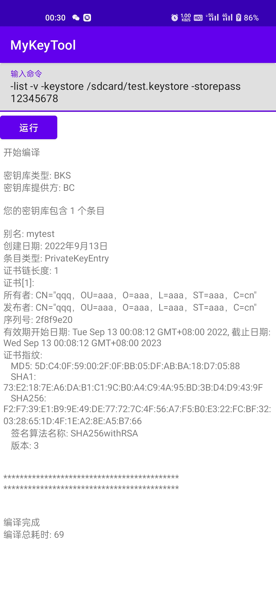

# MyKeyTool
This is [YutakaAoki'](https://github.com/YutakaAoki/KeyTool) fork of the KeyTool project, According to this project, it is convenient to generate keystore directly on the mobile phone.

## 例子:
`-genkey -v -keystore /sdcard/a.jks -alias wumin -storepass 123456 -keypass 123456 -keyalg RSA -keysize 2048 -validity 3650 -dname CN=qqq,OU=aaa,O=aaa,L=aaa,ST=aaa,C=CN`
## 例子:
`-importkeystore -srckeystore /storage/emulated/0/a.jks -destkeystore /storage/emulated/0/test.jks -deststoretype pkcs12 -storepass 123456 -srcstorepass 123456`
## 测试:

## 测试:

## 测试:

## 测试:

